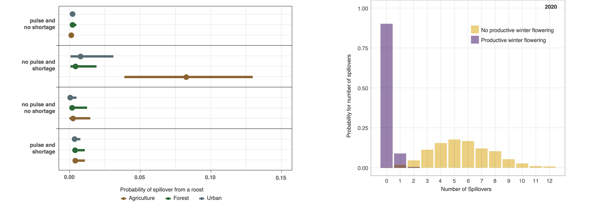

```{r setup, include=FALSE}
knitr::opts_chunk$set(echo = FALSE)
knitr::opts_chunk$set(message = FALSE)
library(knitr)
library(ggplot2)
library(dplyr)
library(mnormt)
library(circular)
```


## My Research Philosophy

"The best thing about being a statistician is that you get to play in everyone's backyard." - John Tukey
\

```{r, out.width = "2000px"}
knitr::include_graphics("lavalake.jpg")
```

## Statistical Collaboration & Research 

Statistical research emerges from the interface of complex datasets and collaborations with scientists

## Statistical Collaboration

> - Raina Plowright and Bat One Health Team, MSU

```{r, out.width = "2000px"}

```

## Statistical Collaboration 


```{r, out.width = "2000px"}
knitr::include_graphics("batone2.png")
```

## Statistical Collaboration 

```{r, out.width = "2000px"}

```

## Talk Overview:

> 1. Network models for predicting Hendra Virus spillover

```{r, out.width = "2000px"}

```


## Talk Overview:

> 2. Land Use Induced Spillover and Eco Countermeasures

```{r, out.width = "800px"}

```


## Talk Overview:

> 3. Data integration for pooled sampling and estimation of CoV prevalence

```{r, out.width = "2000px"}
knitr::include_graphics("GP.png")
```


# Part 1: Network models for predicting Hendra Virus spillover

## Zoonotic Spillover

- Zoonotic spillover is the transmission of pathogens from animals to humans.

- Viral shedding is when cells hosting the infection release ("shed") infectious virus particles.

- DARPA: PREventing EMerging Pathogenic Threats (PREEMPT) program focused on Henipaviruses: (PREEMPT D18AC000031)

## Zoonotic Spillover: Nipah

```{r, out.width = "800px"}

```

## Zoonotic Spillover: Hendra

```{r, out.width = "800px"}
knitr::include_graphics("Hendra_news.png")
```


## Zoonotic Spillover: Hendra
- Hendra virus primarily infects fruit bats (flying foxes)

- Hendra virus can spillover from bats to horses and from horses to humans 

- Hendra virus has extremely high mortality rate > 57 %

## Research Questions

- Understand impact of land use characteristics and spatiotemporal dynamics on the risk of zoonotic spillovers of Hendra virus

- Suggest possible "eco-countermeasures" for Hendra spillover


## Elevated ONI -> Food Shortages -> Spillovers
```{r, out.width = "850px"}

```

## Winter Flowering stops spillovers

```{r, out.width = "700px"}
knitr::include_graphics("flowering.png")
```

## Hendra Virus Land Use Characteristics

```{r, out.width = "550px"}
knitr::include_graphics("simplex.png")
```

## Networks Overview

```{r, out.width = "1200px"}

```


## Network Overview

<div style="float: left; width: 50%;">

 - Nodes: variables
 
 - Arrows: edges, connections between variables
 
 - Networks: factorization of joint distribution of all parameters

</div>
<div style="float: left; width: 10%;">
</div>
<div style="float: right; width: 40%;">


</div>

## Conditional Distributions

<div style="float: left; width: 50%;">

$$\begin{align}
f(ONI, Short, Spill) =&\\
f(ONI) \times&\\
f(Short|ONI) \times&\\
f(Spill|Short)
\end{align}$$

</div>
<div style="float: left; width: 10%;">
</div>
<div style="float: right; width: 40%;">


</div>

## Model Fitting: Binary

>- Binary responses are fit using a Bernoulli distribution. 

\begin{align}
y_{ij}& \sim Bernoulli(\theta_i)\\
\theta_i & \sim Beta( \omega (\kappa - 2) + 1, (1 - \omega)(\kappa - 2) + 1)\\
\omega & \sim Beta(a_\omega, b_\omega)\\
\kappa & \sim Gamma(a_\kappa, b_\kappa)
\end{align}

## Model Fitting: Categorical

>- Categorical responses are fit using a Multinomial distribution

\begin{align}
\underline{y}_{ij} & \sim multinomial(\underline{\theta}_i)\\
\underline{\theta}_i & \sim Dirichlet(\kappa \times  \underline{\phi})\\
\underline{\phi} &\sim Dirichlet(k \times \underline{p})\\
\kappa & \sim gamma(a,b)
\end{align}


## Predictive Validation

<div style="float: left; width: 50%;">

 - Posterior predictive distribution:
 $p(y^{*}|y) = \int p(y^{*}|\theta) p(\theta|y) d \theta$
 
 - log pointwise predictive density (LPD):
 $\sum_{i=1}^n \log p(y_i^{*}|y)$
 
 - Expected LPD is evaluated with leave one out cross validation (LOOCV)
 
 
</div>
<div style="float: left; width: 10%;">
</div>
<div style="float: right; width: 40%;">


</div>

## Final Network


## Spillover Risk

```{r, out.width = "5000px"}

```

## Eco-Countermeasures

# Part 2: Animal Movement Models for Eco-Countermeasures


## {data-background-video="bats2019.mp4"}

## {data-background-video="bats2020b.mp4"}

## {data-background-video="bats2020.mp4"}

## Research Questions

- Identify and understand if behavioral and movement patterns differ as a function of food availability

- Evaluate impact of potential eco-countermeasures (replanting trees)

- Productive winter flowering comes eucalyptus trees, so ongoing cooperation with Koala reforestation programs can help here too


## Agent Based Models for Animal Movement

- Agent based models are a simulation based approach using a set of _agents_.

- Each agent is given a relatively simple set of rules, which control interactions between agents.

- The collective behavior of agents can model complex population level characteristics.


## Agent Properties
The agents have a set of characteristics:

- step length
- angular heading
- home range affinity
- interaction with other agents

Furthermore the characteristics will vary:

- based on a Markov switching model as a function of food availability


## Step Length and Angular Direction

```{r, out.width = "900px"}
knitr::include_graphics("/Volumes/GoogleDrive/My Drive/Research/presentations/MSU_Colloquium/turn_angle.png")
```


## Data Model

$$\underline{z}_{t} = H_t \underline{s}_{t} + \underline{\epsilon}_t, \; \; \;\;\;\; \underline{\epsilon}_t \sim N(0,\sigma^2_{\epsilon} I)$$
where $\underline{z}_t$ is a matrix of the observed locations for the agents at time t, $H_t$ is an incidence matrix to determine whether an agent is observed at time t, $\underline{s}_t$ is the latent location at time, and $\epsilon_t$ is the error process

## Process Model

$$\underline{s}_{i,t} = \underline{s}_{i,t-1} + u_{i,t}\underline{\delta}_{i,t} + \underline{\eta}_{i,t}$$

>- $u_{i,t}$ represents the speed
>- $\underline{\delta}_{i,t}$ is a unit vector for the directional component of the velocity

#### Angular Heading
$$\left(\delta_{x,i,t}, \delta_{y,i,t}\right)' = \left( \cos(\theta_{i,t}), \sin(\theta_{i,t}) \right)$$ 
$$\theta_{i,t}  \sim ProjNormal(\mu, \kappa)$$
>- $\mu$ is an angular heading and $\kappa$ is a concentration parameter

#### Speed
$$u_{i,t} = LN(\mu_u, \sigma^2_u)$$


## NSF Rules of Life Grant

```{r, out.width = "800px"}

```

## Integrating Telemetric Data with Radar

```{r, out.width = "900px"}

```

# Part 3: Dynamics of Coronavirus Infection in Bats

## Dynamics of Coronavirus Infection in Bats


<div style="float: left; width: 60%;">

- In March 2020, DARPA shifted attention from henipaviruses to coronaviruses

- We proposed investigating spatiotemporal dynamics of CoV shedding in bats.
 
 
</div>
<div style="float: left; width: 10%;">
</div>
<div style="float: right; width: 30%;">

```{r, out.width = "150px"}
knitr::include_graphics("Cov-tree.png")
```

</div>


## Research Questions

- Can we establish a baseline understanding of spatiotemporal dynamics of CoV shedding in bats?

- Can we use pooled testing, without follow up, be used to obtain more precise prevalence estimates?

- Can an adaptive pooling approach result in efficient pool size?

- Can spatiotemporal dynamics of Cov prevalence be inferred from pooled testing?

## Pooled Testing

```{r, out.width = "800px"}
knitr::include_graphics("pool1.png")
```

## Pool Structure?

```{r, out.width = "800px"}

```


## Pooled Prevance 

```{r, out.width = "800px"}
knitr::include_graphics("Pool_prev.png")
```

## Optimal Pooling

$\pi = 1 - (1-p)^k$

- where $\pi$ is the probability of a pool of size k testing positive

- $p$ is the prevalence in the population

- optimal pool size depends on unknown $p$

## Adaptive Pooling

- Using a pooled sampling framework we can estimate population prevalence (with uncertainty) 

- That prevalence can be used to update pool size and re-estimate prevalence...


## Gaussian Process

<div style="float: left; width: 60%;">

```{r, out.width = "750px"}

```

 
</div>
<div style="float: left; width: 10%;">
</div>
<div style="float: right; width: 30%;">

Prevalence changes over time

- A Gaussian process can "connect the dots"

</div>

## Gaussian Process

```{r, out.width = "2000px"}
knitr::include_graphics("GP.png")
```

## Next Steps

- Incorporating "spatial" information from several different roosts

- Integrating individual bat data from captured bats to understand potential differences in shedding across demographic & immunological characteristics

- Relating (elevated) prevalence to other factors

# Questions

# Extra Stuff

## Model Fitting

- Despite the _Bayesian_ network moniker, networks do not necessarily indicate _Bayesian_ inference.

- The term _Bayesian_ here refers to conditional probabilities 

- The model framework includes hierarchical components to account for multiscale nature of the data.

## Model Fitting: Count

>- Count responses are fit using a negative binomial distribution

\begin{align}
y_{i} & \sim neg binomial(\mu, \phi)\\
\mu & \sim gamma(a, b)\\
\phi & \sim gamma (a_\phi, b_\phi)\\
\end{align}

